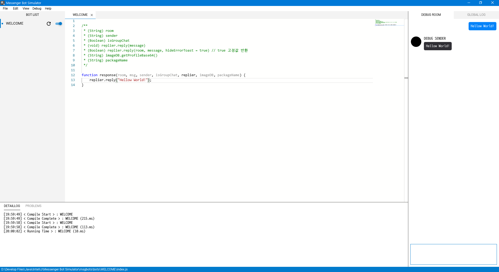
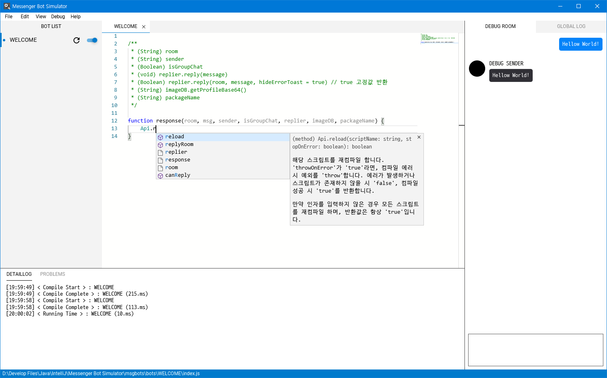
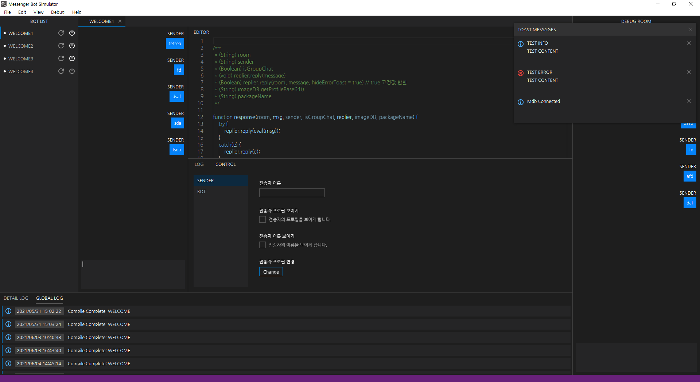

# Messenger Bot Simulator : "Msgbots"

메신저 봇 시뮬레이터는 아직 베타버전이므로 동작 시 발생하는 버그가 많을 수 있습니다.

때문에 안정적인 동작을 보장할 수 없으며 임의로 파일 수정 시 프로그램이 동작하지 않을 수 있습니다.

## Messenger Bot Simulator

메신저 봇 시뮬레이터는 사용자가 메신저에서 봇을 돌리기 이전에 해당 코드를 미리 시뮬레이션 할 수 있는 프로그램입니다.

코드 편집 및 우측의 디버그 룸을 통한 시뮬레이션 기능을 통해 실제로 구동하는 것과 같은 환경을 제공합니다.

모나코 에디터를 내장함과 동시에 자동완성 기능을 포함하고 있어 강력한 생산성을 제공합니다.

### Version 0.7.0

### 업데이트 목록
업데이트 내용을 보고 싶다면 https://blog.naver.com/ttyy3388 블로그를 이용해주세요.

### API 문서
https://blog.naver.com/ttyy3388/221850492456

### LICNESE
Licensed under the "GPL-3.0" license.